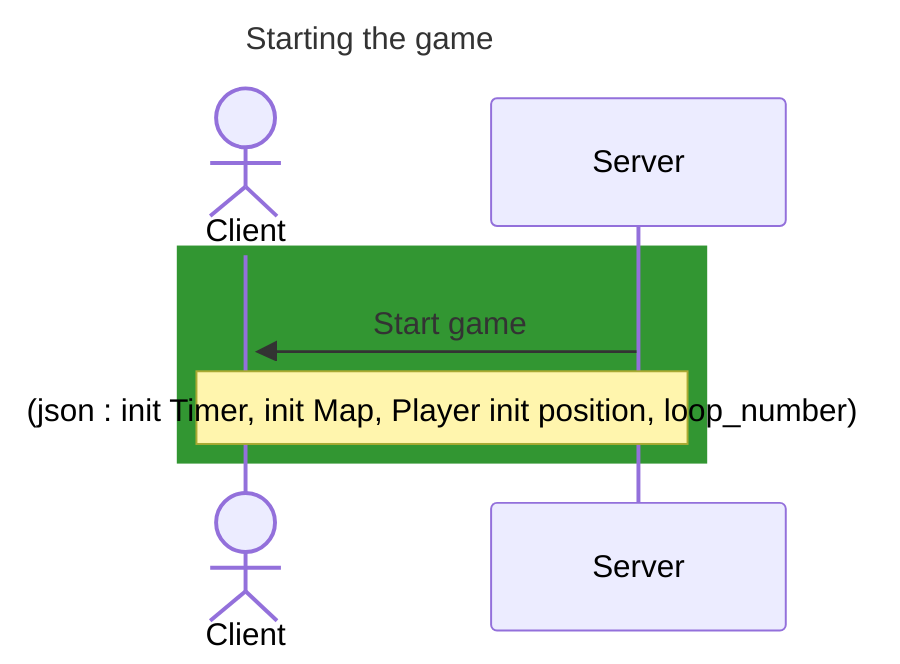
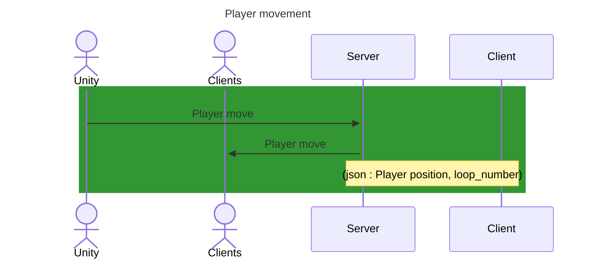
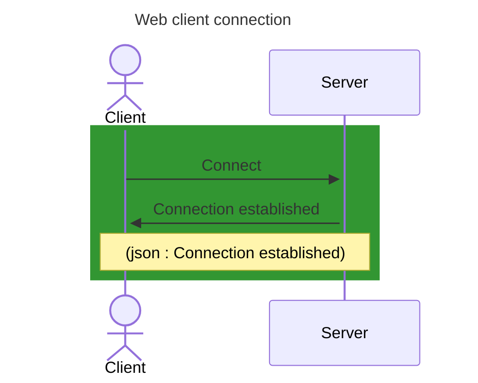
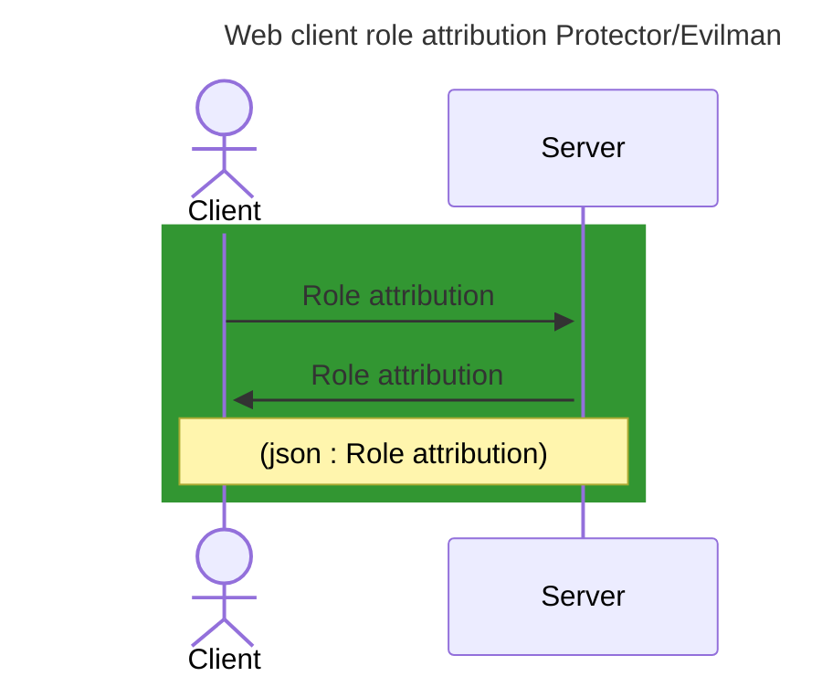
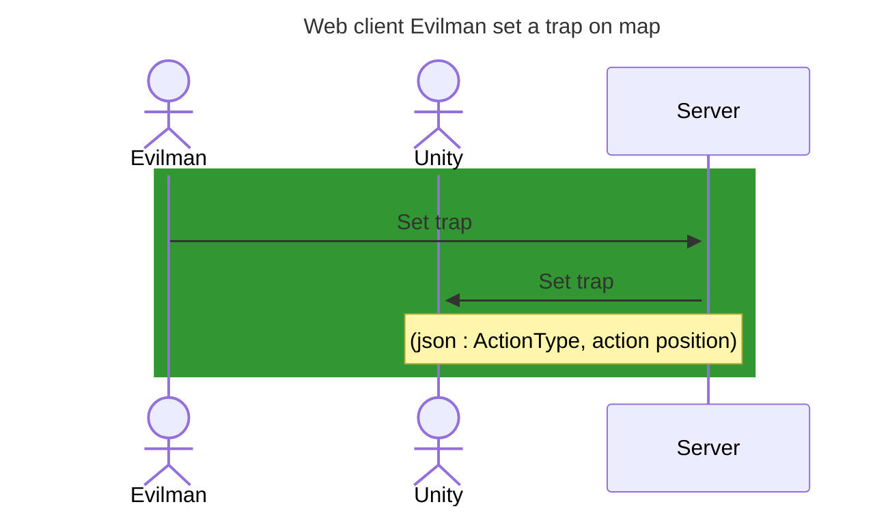
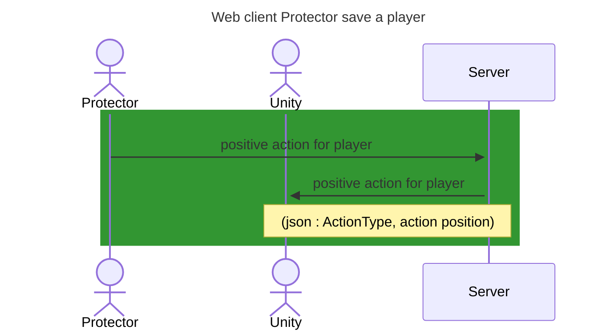
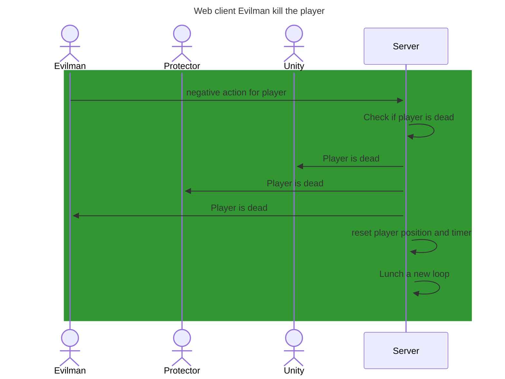
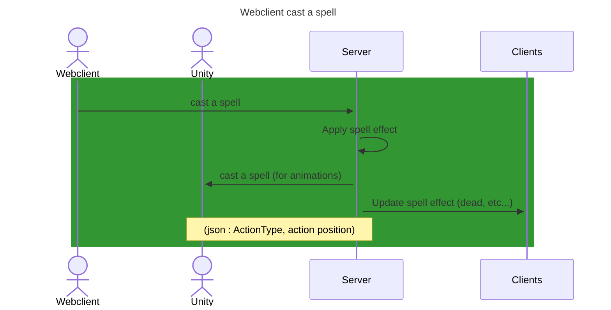

# Interraction diagram

```mermaid
sequenceDiagram
title Starting the game
actor Client
rect rgb(50, 150, 50)
Server ->>+ Client: Start game 
Note over Server, Client: (json : init Timer, init Map, Player init position, loop_number)
end
```

```mermaid
sequenceDiagram
title Player movement
actor Unity
actor Clients
rect rgb(50, 150, 50)
Unity ->>+ Server: Player move
Server ->>+ Clients: Player move
Note over Server, Client: (json : Player position, loop_number)
end
```

```mermaid
sequenceDiagram
title Web client connection
actor Client
rect rgb(50, 150, 50)
Client ->>+ Server: Connect
Server ->>+ Client: Connection established
Note over Server, Client: (json : Connection established)
end
```

```mermaid
sequenceDiagram
title Web client role attribution Protector/Evilman
actor Client
rect rgb(50, 150, 50)
Client ->>+ Server: Role attribution
Server ->>+ Client: Role attribution
Note over Server, Client: (json : Role attribution)
end
```

```mermaid
sequenceDiagram
title Web client Evilman set a trap on map
actor Evilman
actor Unity
rect rgb(50, 150, 50)

Evilman ->>+ Server: Set trap
Server ->>+ Unity: Set trap

Note over Server, Unity: (json : ActionType, action position)
end
```

```mermaid
sequenceDiagram
title Web client Protector save a player
actor Protector
actor Unity
rect rgb(50, 150, 50)

Protector ->>+ Server: positive action for player
Server ->>+ Unity: positive action for player
Note over Server, Unity: (json : ActionType, action position)
end
```

```mermaid
sequenceDiagram
title Web client Evilman kill the player

actor Evilman
actor Protector
actor Unity
rect rgb(50, 150, 50)

Evilman ->>+ Server: negative action for player
Server ->>+ Server: Check if player is dead
Server ->>+ Unity: Player is dead
Server ->>+ Protector: Player is dead
Server ->>+ Evilman: Player is dead
Server ->>+ Server: reset player position and timer
Server ->>+ Server: Lunch a new loop
end
```

```mermaid
sequenceDiagram
title Webclient cast a spell
actor Webclient
actor Unity
rect rgb(50, 150, 50)

Webclient ->>+ Server: cast a spell
Server ->>+ Server: Apply spell effect
Server ->>+ Unity: cast a spell (for animations)
Server ->>+ Clients: Update spell effect (dead, etc...)

Note over Server, Unity: (json : ActionType, action position)
end
```
